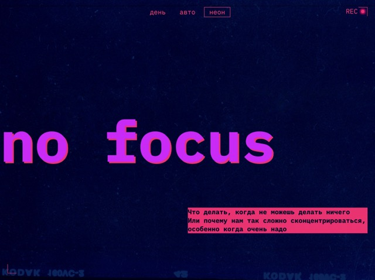

# Проект 3: «Сложно сосредоточиться»

## В этом проекте перед вами серьёзная задача: сверстать адаптивный сайт в светлой и тёмной темах.

## Третья проектная работа по направлению Front-end разработчик на платформе Яндекс Практикум (верстка по макету из фигмы и адаптивный дизайн).

Ссылка для автотестов:
https://github.com/LordMontroz/slozhno-sosredotochitsya.git
